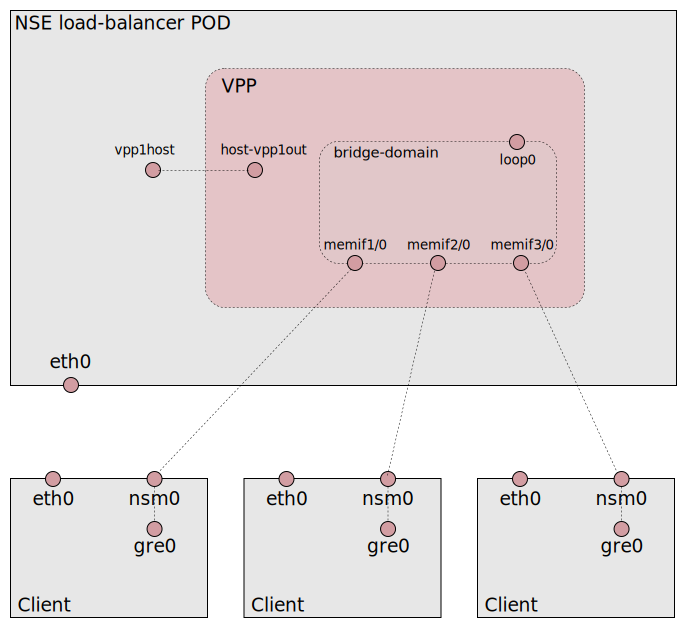

# VPP load-balancer

This is an example how the VPP load-balancer can be used to
load-balance traffic between clients. The "bridge-domain" example is
used as a base to handle the client.

The intention is to use the load-balancer for the traffic separation
use case described in;

* https://github.com/cncf/cnf-testbed/issues/305

To get traffic separation the external interface must be moved to the
NSE POD in some way. This is *not* included in this example instead a
veth-pair is used to get traffic to VPP as described in the [VPP
tutorial](https://wiki.fd.io/view/VPP/Tutorial_Routing_and_Switching).


## Bridge domain setup




Login to the load-balancer POD with `kubectl exec`;
```
kubectl get pods -l networkservicemesh.io/app=load-balancer
kubectl exec -it -c load-balancer <pod-id> bash
```


VPP interfaces (narrowed);
```
# vppctl show int
Name               Idx    State
host-vpp1out                      1      up
local0                            0     down
loop0                             7      up
memif1/0                          2      up
memif2/0                          3      up
memif3/0                          4      up
```

The "10.60.1.0/24" address range is used for the bridge-domain (same
as the "bridge-domain" example). The `loop0` interface gives the local
VPP access to the bridge-domain and is assigned address
`10.60.1.1/24`. Test to "ping" a client via vpp;

```
# vppctl ping 10.60.1.4 repeat 1
116 bytes from 10.60.1.4: icmp_seq=1 ttl=64 time=23.9822 ms

Statistics: 1 sent, 1 received, 0% packet loss
# (test this twice. May fail the first time. Don't know why)
```

The veth-pair creates a path into VPP. It is assigned it's own tiny
network;

```
# vppctl show int addr host-vpp1out
host-vpp1out (up):
  L3 10.70.0.1/31
# ip addr show dev vpp1host
13: vpp1host@vpp1out: <BROADCAST,MULTICAST,UP,LOWER_UP> ...
    inet 10.70.0.0/31 scope global vpp1host
       valid_lft forever preferred_lft forever
    ...
# (yes, 10.70.0.0 is a valid address)
```

A route is setup to the bridge-domain network via the `host-vpp1out` device;

```
# ip route get 10.60.1.1
10.60.1.1 via 10.70.0.1 dev vpp1host src 10.70.0.0 uid 0 
```

You can ping the `loop0` VPP device from linux;
```
# ping -c1 10.60.1.1   
PING 10.60.1.1 (10.60.1.1) 56(84) bytes of data.
64 bytes from 10.60.1.1: icmp_seq=1 ttl=64 time=2.70 ms

--- 10.60.1.1 ping statistics ---
1 packets transmitted, 1 received, 0% packet loss, time 0ms
rtt min/avg/max/mdev = 2.703/2.703/2.703/0.000 ms
```


## TEMPORARY client setup

The "standard" `simple-client` is currently used. It is not
configurable so as a temporary work-around the clients are setup manually;

```
l=networkservicemesh.io/app=simple-client
for p in $(kubectl get pod -l $l -o json | jq -r .items[].metadata.name); do
  kubectl exec -c alpine-img $p ip ro add 10.70.0.0/31 via 10.60.1.1
  kubectl exec -c alpine-img $p ip addr add 10.2.2.0/24 dev lo
  kubectl exec -c alpine-img $p ip link set up dev gre0
done
```

As you can see the `gre0` interface must be set "up". This is because
the VPP lb uses gre encapsulation.

The client is extended with an [mconnect](https://github.com/Nordix/mconnect)
container that opens port tcp/5001 with a server that replies with the
hostname.


## Load-balancer setup

The VIP address is set as an environemt variable in the manifest;

```
    spec:
      containers:
        - name: load-balancer
          env:
            - name: VIP_ADDRESS
              value: "10.2.2.0/24"
```

Check the load-balancer status;
```
vppctl show lb vips verbose
```

## Manual testing

The load-balancer POD is extended with an "alpine" container (same as
the "simple-client") which has more tools for testing. Login with;

```
kubectl get pods -l networkservicemesh.io/app=load-balancer
kubectl exec -it -c alpine-img <pod-id> bash
```

Inside the alpine container use netcat (nc) to check load-balancing;

```
nc 10.2.2.2 5001 < /dev/null; echo
# (repeat...)
```


## Implementation and trouble shooting

The lb is setup using the [nsehook.sh](./pod/bin/nsehook.sh)
script. Check and alter as you see fit.

The commands executed are logged;

```
kubectl get pods -l networkservicemesh.io/app=load-balancer
kubectl logs -c load-balancer <pod-id> | grep NSE_HOOK
```
